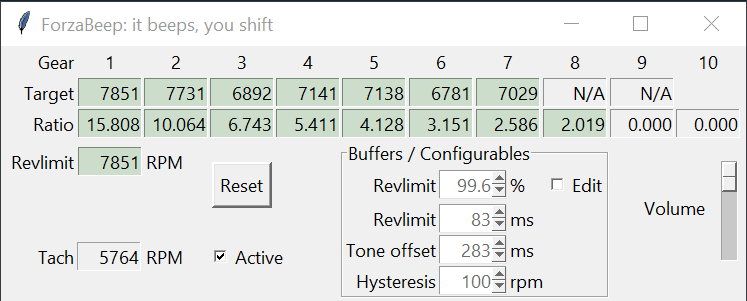

# ForzaBeep
_It beeps, you shift._

**GUI application to provide a shift tone in Forza Horizon 5.**

### Enable remote telemetry / Data out
To enable remote telemetry in Forza Horizon 5 on PC for this application: 
- Head to Settings -> HUD and Gameplay -> scroll down to the bottom
- Set Data Out to On, enter 127.0.0.1 as Data out IP address and Data out IP port 12350. You may have to restart the game.
  - XBox remote telemetry is to my knowledge broken, but would otherwise require the Data Out IP Address to be your laptop's IP address instead and the address modified in config.json. This is untested.

## Considerations
While it is intended to run in the background without consideration while driving, there are some requirements to having accurate shift tones:
- Drive for over one second in a single gear on road. After this the gear values will lock and turn green. Road surfaces are far more accurate than dirt/off-road.
- Starting from a low to medium RPM accelerate at full throttle all the way to rev limit. Rev limit should normally be avoided, but must be hit once for accurate data. Avoid impacts.
  - At minimum the power at the start must be equal or lower than power at revlimit. For most cars this is easy to achieve by starting at around halfway redline.
  - Boost is taken into account. Some cars with very high boost may require a run at relatively low rpm in a relatively high gear to ensure enough data points at peak boost.
- a more accurate rev limit is derived from the required run. Defaults to maximum engine rpm minus 750.

## Implementation
There are three triggers:
- Shift RPM: The RPM value in which power in the next gear becomes equal or higher to the power in the current gear. If the application predicts shift RPM is reached in the defined tone offset time, trigger a beep.
- Percentage of revlimit: Uses the tone offset distance as predicted distance to current RPM hitting the listed percentage of rev limit.
  - Example: A rev limit of 7850 and a value of 99.6% triggers a beep if it predicts 7818.6 rpm will be reached in 283 milliseconds.
- Time distance to revlimit: uses the tone offset value plus the revlimit ms value as predicted distance to current RPM hitting the defined revlimit. Defaults to 367 milliseconds.

The delay between beep triggers is currently set to 0.5 seconds. This time-out is shared between the three triggers. If you choose to not shift, the program will not beep again even if revlimit is hit.

## Settings
The settings are saved to config.json on exit. This includes revlimit %, revlimit ms, tone offset, hysteresis, and volume.
The settings are not saved for now. Restarting the application results in a blank state including configuration.
Remote telemetry sends data at 60 packets per second. The offset variables (Tone offset, revlimit ms) while defined in milliseconds currently use packet counts in the backend. There is one packet per 16.667 milliseconds, approximately.

### Per gear:
- RPM: Derived shift rpm value. This requires the ratio of the current gear and the next gear to be determined (green background)
- Ratio: Derived gear ratio including final ratio. Final ratio cannot be separately derived.

### General configuration:
- Revlimit: The limit on engine RPM by its own power. Initial guess is maximum engine rpm minus 750. Revlimit is derived upon finishing a full throttle sweep up to revlimit.
- Tone offset: Predicted distance between the beep trigger and the trigger rpm value. This should not be taken as reaction time and minimized. It should be regarded as the time you can consistently respond to the tone with the least amount of mental effort. Defaults to 283 ms.
- Revlimit %: The respected rev limit in percentage of actual rev limit. This is to create a buffer for transients that could cause the engine to cut out due to hitting actual rev limit. Defaults to 99.6%.
- Revlimit ms: The minimum predicted distance to actual rev limit. This is to create a buffer for fast changes in RPM that would otherwise lead to hitting actual rev limit, such as in first gear. Defaults to 83ms.
- Hysteresis: Hysteresis may be set as another layer to smooth rpm. An intermediary rpm value is updated only if the change in rpm is larger than the hysteresis value, which is then used for the shift beep tests. Defaults to 1 rpm currently.
- Volume: Adjusts the volume of the beep in four steps total. Each step is about half as loud as the previous, where the loudest is the default.
- Active tickbox: If unticked, application will not track incoming packets and therefore not beep or update.
- Edit tickbox: If unticked, the up and down arrows for the Tone offset, Revlimit ms/% and Hysteresis values do not function. This is to avoid accidental clicks.
- Reset button: If pressed, reset revlimit and all values for all gears. Configuration values are unchanged. If the UI is unresponsive, restart the application.

