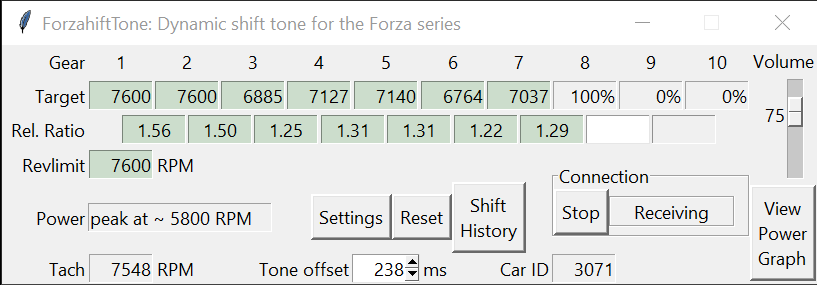
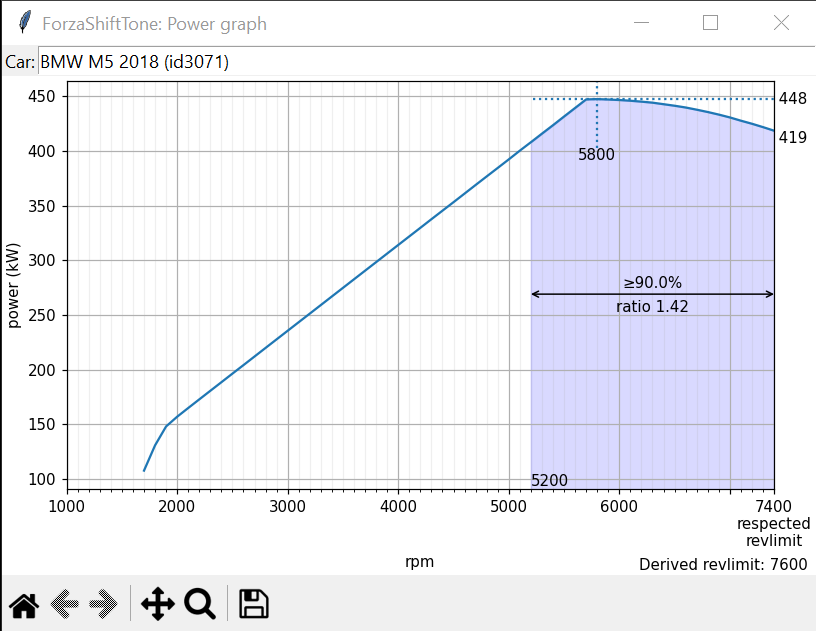

# ForzaShiftTone

**Calibrated audio tone that indicates when to shift for optimal acceleration in Forza Motorsport / Horizon 4/5**

## TL;DR

- Per gear: Drive around on flat tarmac until you hear a double beep
  - Maintain fixed speed if it has trouble locking the gear ratio
- On a flat straight: Hold full throttle starting from low rpm until you hear a triple beep
  - Use a gear with low/no wheelspin but able to hit revlimit before the end of the straight
  - Try again if you hit the rev limiter for several consecutive seconds with no triple beep
- Be aware that false positives exist: not every beep is an upshift.

### Enable Data Out in Forza Motorsport / Forza Horizon 4/5

To configure Data Out (remote telemetry) in supported Forza games on Steam for this application: 
- Head to **Settings** -> **Gameplay & HUD** -> scroll down to the bottom (**HUD and Gameplay** in Forza Horizon 5)
- Set **Data Out** to _On_, enter _127.0.0.1_ as **Data out IP address** and **Data out IP port** _12350_. You may have to restart the game.
- The **Data Out Packet Format** should be set to '_Car Dash_' for Forza Motorsport
- The Microsoft Store version may require a 3rd party Loopback Utility
- It is unknown whether the Data Out functions on the consoles at all
  - If it works, enter the IP address of your laptop instead of _127.0.0.1_

## Current release
**ForzaShiftTone.vbs**: to launch the application (Preferred)  
**ForzaShiftTone-debug.bat**: to launch the application with an additional commandline window that shows debug information
**forzabeep.py**: for python users

Changes:  
- Large back-end rewrite
- Added shift history window for the past 10 shifts
- Updated shift logic to include the latest FM style shift

## Implementation

The Tone Offset is dynamic. The program keeps track of the time between a shift tone and an initiated shift, and modifies the running Tone Offset if the tone is early or late.
There are three triggers:
- **Shift RPM**: The RPM value at which power in the current becomes lower than the power in the next gear: the ideal time to upshift. If the application predicts shift RPM is reached in the defined tone offset time, trigger a beep
- **Percentage of revlimit**: Uses the tone offset distance as predicted distance to current RPM hitting the listed percentage of rev limit
  - Example: A rev limit of 7500 and a value of 98.0% triggers a beep if it predicts 7350 rpm will be reached in 283 milliseconds
- **Time distance to revlimit**: uses the tone offset value plus the revlimit ms value as predicted distance to current RPM hitting the defined revlimit. Defaults to 100 milliseconds, which leads to a prediction distance of 383ms

The delay between beep triggers is currently set to 0.5 seconds. This time-out is shared between the three triggers.  
If you choose to not shift and remain above the trigger rpm, the program will not beep again even if revlimit is hit.

### General display values:

- **Revlimit**: The limit on engine RPM by its own power. Revlimit is derived upon finishing a full throttle sweep up to revlimit.
- **Revbar**: The range in which the revbar lights up. It begins at 85% and starts blinking at 99% of a predetermined value, generally equal to the upshift line in the Transmission tuning page but not always
- **Power**: A guesstimate on which RPM peak power is hit. If it matches the in-game value, the power curve is probably quite accurate.
- **Tach**: The current RPM value as reported by the telemetry. Updates 30 times per second.
- **Car ID**: The internal ID of the car. The RPM/Power/Torque table is saved with this ID as filename, for example a car with Car ID 432 will have its data saved to _curves\432.tsv_.

### Per gear:

- **Target**: The derived shift rpm value.  
This requires a power curve and the ratio of the current gear and the next gear to be determined (green background)
- **Rel. Ratio**: The relative ratio of the gear ratios between two consecutive gears.  
If gear 1 has a drivetrain ratio of 15 and gear 2 has a drivetrain ratio of 11 then the relative ratio is 15/11 = 1.36 approximately
- **Ratio**: The gear ratio of the gear
  - Toggle between Ratio and Rel. Ratio by double clicking the "Ratio" or "Rel. Ratio" label text

### General configuration:

- **Tone offset**: Predicted distance between the beep trigger and the trigger RPM value. This should not be taken as reaction time and minimized. It should be regarded as the time you can consistently respond to the tone with the least amount of mental effort. Defaults to 283 ms.
- **Volume**: Adjusts the volume of the beep in four steps total. Each step is about half as loud as the previous, where the second loudest is the default. A value of 0 mutes only the shift beep.
- **Reset button**: If pressed, reset revlimit, power curve and all values for all gears. Configuration values are unchanged. If the UI is unresponsive, restart the application.
- **Start/Stop button**: Stops or starts the loop to collect packets. In short, if button says "Stop" it is running, if it says "Start" the program is not tracking the game's packets and will not beep.
- **Shift history**: Displays a table with the last 10 shifts including target RPM, actual shift RPM, gear and measured offset between beep and shift.
- **View graphs button**: If enabled and pressed, displays a power graph in a separate window. 

In Settings:  
- **Hysteresis**: Hysteresis may be set as another layer to smooth RPM. An intermediary RPM value is updated only if the change in RPM is larger than the hysteresis value, which is then used for the shift beep tests. Defaults to 0.5% of maximum engine RPM.
- **Revlimit %**: The respected rev limit in percentage of actual rev limit. This is to create a buffer for transients that could cause the engine to cut out due to hitting actual rev limit. Defaults to 98.0%.
- **Revlimit ms**: The minimum predicted distance to actual rev limit. This is to create a buffer for fast changes in RPM that would otherwise lead to hitting actual rev limit, such as in first gear. Defaults to 100ms.
- **Dynamic Tone Offset**: Enables or disables the dynamic updating of the tone offset.
- **Include replays**: Sets the program to function during replays: useful primarily to log shift points in a replay.

## Power graph example

## Settings file

The settings are saved to _config.json_ on exit. This includes Tone offset, Hysteresis, Revlimit %, Revlimit ms and Volume. The power curve and gear ratios are not saved.  
Remote telemetry sends data at 60 packets per second. The offset variables (Tone offset, revlimit ms) while defined in milliseconds currently use packet counts in the backend.  
There is one packet per 16.667 milliseconds, approximately.

## Known issues
- Application will on rare occasions crash: related to the UI library and cannot be fixed
- Due to noise in the power curve it is not always possible to derive a correct peak power value in terms of rpm. It can be off by 100 rpm.
- Gear ratios may not reasonably match in-game values for AWD: Front/rear tires may have different sizes
