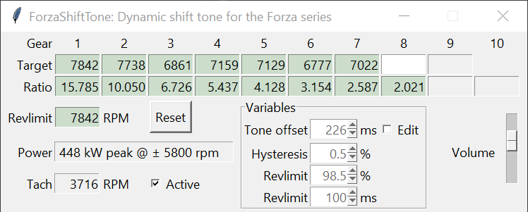

# ForzaShiftTone

**Windows GUI application to provide a shift tone in Forza Motorsport or Forza Horizon 4/5.**

## TL;DR

- Drive around on tarmac per gear until you hear a double beep
  - Maintain fixed speed if it has trouble locking the gear ratio
- On flat tarmac: Apply full throttle from low rpm until you hear a triple beep
  - Use a gear with low/no wheelspin
  - Try again if you hit the rev limiter with no triple beep
- Be aware that false positives exist: not every beep is an upshift.

### Enable remote telemetry / Data out in Forza Motorsport

To enable remote telemetry in Forza Horizon 5 on Steam for this application: 
- Head to Settings -> Gameplay & HUD -> scroll down to the bottom
- Set Data Out to On, enter 127.0.0.1 as Data out IP address and Data out IP port 12350. You may have to restart the game.
- The Data Out Packet Format should be set to 'Car Dash'
- The Microsoft Store version may require a 3rd party Loopback Utility
- It is unknown whether the Data Out functions on the consoles at all

## Current release

If you are unsure which file to pick, download the  **ForzaShiftTone.v0.7-beta.zip** file. 
The **ForzaShiftTone.v0.7-beta_debug.zip** file will open a commandline prompt with extra debug information alongside the GUI.

Changes:  
- **Revlimit guess disabled: program will _not_ beep until gears plus power curve have been collected.**
- Added Forza Motorsport support
- Added display of peak Power with associated rpm value
- Power curve locks if it's three or more seconds long
- Hysteris defaults to percentage of engine_max_rpm
- Updated debug target shift rpm to be dynamic (Only for _debug build)
- PI changes now cause a reset
- Respected rev limit at 98.5% by default
- Additional tone offset to 100ms from 83ms for revlimit time distance trigger
- Hysteresis defaults to 0.5% of engine_max_rpm

## Considerations

While it is intended to run in the background without consideration while driving once calibrated, there are some requirements to having accurate shift tones:
- The gear ratio per gear requires one second of consistent data. This is best achieved by driving on flat tarmac.
  - If the gear ratio for that gear turns green there is no further data collection, it is locked in place.
  - Road surfaces are far more accurate than dirt/off-road
  - For AWD cars: maintain throttle at a fixed amount at speed for the first gear or two
- The power curve requires a sweep from low RPM all the way to the rev limiter.
- Starting from a low to medium RPM accelerate at full throttle all the way to rev limit. Rev limit should normally be avoided, but must be hit once for accurate data. Avoid impacts. There will be a short triple beep if succesful.
  - At minimum the power at the start must be equal or lower than power at revlimit. For most cars this is easy to achieve by starting at around halfway redline
  - Boost is taken into account. Some cars with very high boost may require a run at relatively low rpm in a relatively high gear to ensure enough data points at peak boost
  - Flat tarmac is preferable.

### Browser/Windows warnings

The current release is a Pyinstaller package that is not signed. This means various browsers and Smartscreen inside Windows are going to complain the file is unsafe or an uncommon download. Future releases will remain unsigned as it is not worthwhile.  

## Implementation

The Tone Offset is dynamic. The program keeps track of the time between a shift tone and an initiated shift, and modifies the running Tone Offset if the tone is early or late.
There are three triggers:
- Shift RPM: The RPM value at which power in the current becomes lower than the power in the next gear: the ideal time to upshift. If the application predicts shift RPM is reached in the defined tone offset time, trigger a beep
- Percentage of revlimit: Uses the tone offset distance as predicted distance to current RPM hitting the listed percentage of rev limit
  - Example: A rev limit of 7500 and a value of 98.5% triggers a beep if it predicts 7387.5 rpm will be reached in 283 milliseconds
- Time distance to revlimit: uses the tone offset value plus the revlimit ms value as predicted distance to current RPM hitting the defined revlimit. Defaults to 100 milliseconds, which leads to a prediction distance of 383ms.

The delay between beep triggers is currently set to 0.5 seconds. This time-out is shared between the three triggers.  
If you choose to not shift and remain above the trigger rpm, the program will not beep again even if revlimit is hit.

### Enable remote telemetry / Data out in Forza Horizon 5
To enable remote telemetry in Forza Horizon 5 on Steam for this application: 
- Head to Settings -> HUD and Gameplay -> scroll down to the bottom
- Set Data Out to On, enter 127.0.0.1 as Data out IP address and Data out IP port 12350. You may have to restart the game.
  - XBox Data Out is to my knowledge broken, but would otherwise require the Data Out IP Address to be your laptop's IP address instead and the address modified in config.json. This is untested.
  - For the Microsoft Store version, install the Loopback Utility found on the internet.

## Settings

The settings are saved to _config.json_ on exit. This includes Tone offset, Hysteresis, Revlimit %, Revlimit ms and Volume.  
Remote telemetry sends data at 60 packets per second. The offset variables (Tone offset, revlimit ms) while defined in milliseconds currently use packet counts in the backend.  
There is one packet per 16.667 milliseconds, approximately.

### Per gear:

- Target: Derived shift rpm value. This requires the ratio of the current gear and the next gear to be determined (green background)
- Ratio: Derived gear ratio including final ratio. Final ratio cannot be separately derived and for AWD the ratio is not identical to the in-game gearing values.

### General configuration:

- Revlimit: The limit on engine RPM by its own power. Revlimit is derived upon finishing a full throttle sweep up to revlimit.
- Tone offset: Predicted distance between the beep trigger and the trigger rpm value. This should not be taken as reaction time and minimized. It should be regarded as the time you can consistently respond to the tone with the least amount of mental effort. Defaults to 283 ms.
- Revlimit %: The respected rev limit in percentage of actual rev limit. This is to create a buffer for transients that could cause the engine to cut out due to hitting actual rev limit. Defaults to 98.5%.
- Revlimit ms: The minimum predicted distance to actual rev limit. This is to create a buffer for fast changes in RPM that would otherwise lead to hitting actual rev limit, such as in first gear. Defaults to 100ms.
- Hysteresis: Hysteresis may be set as another layer to smooth rpm. An intermediary rpm value is updated only if the change in rpm is larger than the hysteresis value, which is then used for the shift beep tests. Defaults to 0.5% of maximum engine RPM.
- Volume: Adjusts the volume of the beep in four steps total. Each step is about half as loud as the previous, where the second loudest is the default.
- Active tickbox: If unticked, application will not track incoming packets and therefore not beep or update.
- Edit tickbox: If unticked, the up and down arrows for the Tone offset, Revlimit ms/% and Hysteresis values do not function. This is to avoid accidental clicks.
- Reset button: If pressed, reset revlimit and all values for all gears. Configuration values are unchanged. If the UI is unresponsive, restart the application.

## Known issues
- The tone offset will not update: Slowing down and shifting up/down to first seems to work best
- The python variant will on rare occasions crash: seems to be mttkinter related and is unlikely to be fixed
- The power curve is not filtered. Noisy data can cause target shift rpm that are incorrect.
