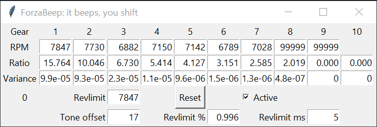

# ForzaBeep
It beeps, you shift.

GUI application to provide a shift tone in Forza Horizon 5. This is the first public version.

To enable remote telemetry in Forza Horizon 5 on PC for this application: 
- Head to Settings -> HUD and Gameplay -> scroll down to the bottom
- Set Data Out to On, enter 127.0.0.1 as Data out IP address and Data out IP port 12350. You may have to restart the game. Xbox remote telemetry is to my knowledge broken.

While it is intended to run in the background without consideration while driving, there are some requirements to having accurate shift tones:
- One uninterrupted second of data per gear, on road. After this the gear values will lock and the gear ratio derived to a reasonably accurate degree. Road surfaces are far more accurate than dirt/off-road.
- An unobstructed full throttle acceleration in a medium gear all the way to rev limit. Rev limit should normally be avoided, but must be hit once for accurate data. Avoid impacts.
  - At minimum the power at the start must be equal or lower than power at revlimit. For most cars this is easy to achieve by starting at around halfway redline.
- Rev limit can be manually entered or derived from the required run. Defaults to maximum engine rpm minus 750.
- The data is not saved for now. Restarting the application results in a blank state including configuration.

## Implementation
Three triggers:
- Shift RPM: The RPM value in which power in the next gear becomes equal or higher to the power in the current gear. If the application predicts shift RPM is reached in the defined tone offset time, trigger a beep.
- Percentage of revlimit: Uses the tone offset distance as predicted distance to current RPM hitting the listed percentage of rev limit.
  - Example: A rev limit of 7850 and a value of 0.996 triggers a beep if it predicts 7818.6 rpm will be reached in 17 frames (or less).
- Time distance to revlimit: uses the tone offset value plus the revlimit ms value as predicted distance to current RPM hitting the defined revlimit. Defaults to 17+5=22 packets (366.7 ms)
The delay between beep triggers is currently hardcoded to 0.5 seconds. This time-out is shared between the three triggers.

## Settings
The settings are not saved for now. Remote telemetry sends data at 60 packets per second, and the offset variables (Tone offset, revlimit ms) are defined in packets. There is one packet per 16.667 milliseconds, approximately.

### Per gear:
- RPM: Derived or manually entered shift rpm value. A value of 99999 means it is inactive.
- Ratio: Derived or manually entered gear ratio including final ratio.
- Variance: Derived variance for gear ratios derived while driving in this gear. Display value, not editable.

### General configuration:
- Revlimit: The limit on engine RPM by its own power. Initial guess is maximum engine rpm minus 750. Can be derived or manually entered.
- Tone offset: Predicted distance between the beep trigger and the trigger rpm value. This should not be taken as reaction time and minimized. It should be regarded as the time you can consistently respond to the tone with the least amount of mental effort. Defaults to 17 packets (283.3ms)
- Revlimit %: The respected rev limit in percentage of actual rev limit (currently divided by 100). This is to create a buffer for transients that could cause the engine to cut out due to hitting actual rev limit. Defaults to 0.996 as 99.6%.
- Revlimit ms: The minimum predicted distance to actual rev limit. This is to create a buffer for fast changes in RPM that would otherwise lead to hitting actual rev limit. Defaults to 5 packets (83ms)
- Active tickbox: If unticked, application will not track incoming packets and therefore not beep or update.
- Reset button: If pressed, reset revlimit and all values for all gears. Configuration values are unchanged. If the UI is unresponsive, restart the application.
